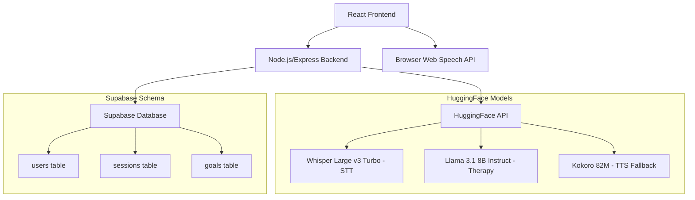

# Design Document

## Overview

Numa is a voice-only CBT-based AI therapist web application built with a modern, cost-effective architecture using open source models via HuggingFace API. The system prioritizes rapid deployment, minimal operational costs, and therapeutic effectiveness through a clean separation of concerns between frontend interaction, backend processing, and AI services.

## Architecture

### High-Level Architecture



### Technology Stack

**Frontend:**
- React 18 with functional components and hooks
- Tailwind CSS for minimalistic monochrome styling
- Web Audio API for microphone access
- Browser Web Speech API for TTS (primary)

**Backend:**
- Node.js with Express.js
- HuggingFace Inference API client
- Supabase JavaScript client
- Multer for audio file handling

**AI Services:**
- **STT**: OpenAI Whisper Large v3 Turbo (0.8B parameters) via HuggingFace
- **Conversation**: Meta Llama 3.1 8B Instruct via HuggingFace
- **TTS**: Browser Web Speech API (primary), Kokoro 82M (fallback)

**Database:**
- Supabase (PostgreSQL) with real-time subscriptions

## UI/UX Design Philosophy

### Minimalistic Monochrome Aesthetic

The interface follows a strict black and white design philosophy that promotes focus, reduces cognitive load, and creates a calming therapeutic environment through visual simplicity.

#### Color Palette
- **Primary**: Charcoal (#353839) for text and primary elements
- **Secondary**: Pure White (#FFFFFF) for backgrounds and negative space
- **Accent**: Grayscale variations (#6B7280, #9CA3AF, #D1D5DB) for subtle differentiation
- **Interactive States**: Inverted colors (white on charcoal) for active/hover states

#### Typography
- **Primary Font**: System font stack for optimal performance and familiarity
- **Hierarchy**: Achieved through font weight (300, 400, 600) and size variations
- **Contrast**: High contrast charcoal (#353839) text on white backgrounds for accessibility
- **Spacing**: Generous white space to create breathing room and focus

#### Visual Elements
- **Buttons**: Clean geometric shapes with subtle shadows using grayscale
- **Microphone**: Minimalist circle design with charcoal (#353839) styling
- **Waveforms**: Simple line-based visualizations in varying gray tones
- **Dividers**: Thin gray lines (#D1D5DB) for content separation
- **Icons**: Simple, geometric icons using stroke-based design in charcoal

#### Layout Principles
- **Centered Design**: All primary interactions centered on screen
- **Minimal UI**: Only essential elements visible at any time
- **Progressive Disclosure**: Information revealed as needed
- **Consistent Spacing**: 8px grid system for all margins and padding
- **Responsive**: Mobile-first approach with touch-friendly targets

#### Animation and Transitions
- **Subtle Movements**: Gentle fade-ins and scale transitions
- **Duration**: 200-300ms for micro-interactions
- **Easing**: Natural easing curves (ease-out) for organic feel
- **Purpose-Driven**: Animations only to provide feedback or guide attention

#### Accessibility Considerations
- **High Contrast**: Exceeds WCAG AAA standards with charcoal/white palette
- **Focus States**: Clear visual indicators using inverted colors
- **Screen Readers**: Semantic HTML with proper ARIA labels
- **Keyboard Navigation**: Full keyboard accessibility for all interactions

## Components and Interfaces

### Frontend Components

#### 1. App Component
- Main application container
- Manages global state (user session, audio permissions)
- Handles routing and authentication

#### 2. VoiceInterface Component
- Central minimalist microphone button (charcoal circle on white background)
- Press-and-hold functionality with subtle scale animation
- Monochrome waveform visualization using varying gray line weights
- Clean recording states: idle (charcoal outline), active (filled charcoal), processing (pulsing gray)
- Audio recording using MediaRecorder API
- Integration with browser Web Speech API for TTS

#### 3. ConversationDisplay Component
- Real-time subtitle display for user and Numa with minimalistic typography
- Conversation history with clean timestamps
- Subtle emotion indicators using monochrome visual cues (opacity, weight, spacing)

#### 4. AudioProcessor Component
- Handles audio recording and playback with minimal visual feedback
- Manages audio format conversion (WebM to WAV)
- Implements audio quality optimization
- Provides subtle loading states using monochrome progress indicators

### Backend API Endpoints

#### 1. `/api/stt` (POST)
```javascript
// Input: FormData with audio file
// Output: { transcription: string, confidence: number }
```

#### 2. `/api/therapy` (POST)
```javascript
// Input: { userId: string, message: string, sessionId?: string }
// Output: { response: string, emotion: string, goal?: string }
```

#### 3. `/api/tts` (POST)
```javascript
// Input: { text: string, voice?: string }
// Output: Audio stream (fallback only)
```

#### 4. `/api/sessions` (GET/POST)
```javascript
// GET: Retrieve user session history
// POST: Create new session or update existing
```

### HuggingFace Integration

#### Model Selection Rationale

**Speech-to-Text: OpenAI Whisper Large v3 Turbo**
- 0.8B parameters - optimal balance of accuracy and speed
- Multilingual support for future expansion
- High accuracy for conversational speech
- Cost-effective via HuggingFace Inference API

**Conversation AI: Meta Llama 3.1 8B Instruct**
- 8B parameters - sufficient for therapeutic conversations
- Strong instruction following capabilities
- Good performance on empathy and reasoning tasks
- Optimized for chat/instruction format

**Text-to-Speech: Kokoro 82M (Fallback)**
- Lightweight 82M parameter model
- Natural-sounding voice synthesis
- Fast inference for real-time applications
- Used only when browser TTS unavailable

## Data Models

### Supabase Schema

#### Users Table
```sql
CREATE TABLE users (
    id UUID PRIMARY KEY DEFAULT gen_random_uuid(),
    name VARCHAR(255),
    created_at TIMESTAMP WITH TIME ZONE DEFAULT NOW(),
    preferences JSONB DEFAULT '{}'
);
```

#### Sessions Table
```sql
CREATE TABLE sessions (
    id UUID PRIMARY KEY DEFAULT gen_random_uuid(),
    user_id UUID REFERENCES users(id),
    date TIMESTAMP WITH TIME ZONE DEFAULT NOW(),
    transcript TEXT,
    summary TEXT,
    emotion VARCHAR(50),
    duration_minutes INTEGER,
    status VARCHAR(20) DEFAULT 'active'
);
```

#### Goals Table
```sql
CREATE TABLE goals (
    id UUID PRIMARY KEY DEFAULT gen_random_uuid(),
    user_id UUID REFERENCES users(id),
    description TEXT NOT NULL,
    created_at TIMESTAMP WITH TIME ZONE DEFAULT NOW(),
    status VARCHAR(20) DEFAULT 'active',
    target_date DATE,
    progress_notes TEXT[]
);
```

### Component Design Specifications

#### Microphone Button Design
```css
/* Base State */
.microphone-button {
  width: 80px;
  height: 80px;
  border-radius: 50%;
  background: white;
  border: 2px solid #353839;
  transition: all 200ms ease-out;
}

/* Active State */
.microphone-button:active {
  background: #353839;
  transform: scale(0.95);
}

/* Recording State */
.microphone-button.recording {
  background: #353839;
  animation: pulse 1.5s ease-in-out infinite;
}
```

#### Conversation Display Layout
```css
.conversation-container {
  max-width: 600px;
  margin: 0 auto;
  padding: 2rem 1rem;
  background: white;
}

.message {
  margin-bottom: 1.5rem;
  padding: 1rem 0;
  border-bottom: 1px solid #D1D5DB;
  color: #353839;
}

.message.user {
  text-align: right;
  font-weight: 300;
}

.message.numa {
  text-align: left;
  font-weight: 400;
}

.timestamp {
  font-size: 0.75rem;
  color: #6B7280;
  margin-top: 0.5rem;
}
```

#### Waveform Visualization
```css
.waveform {
  display: flex;
  align-items: center;
  justify-content: center;
  height: 40px;
  gap: 2px;
}

.waveform-bar {
  width: 2px;
  background: #353839;
  opacity: 0.3;
  transition: all 100ms ease-out;
}

.waveform-bar.active {
  opacity: 1;
  transform: scaleY(var(--amplitude));
}
```

### Frontend State Management

#### Global State (React Context)
```javascript
const AppContext = {
    user: { id, name, preferences },
    currentSession: { id, transcript, emotion },
    audioState: { isRecording, isPlaying, permissions },
    conversationHistory: Array<Message>
}
```

#### Message Interface
```javascript
interface Message {
    id: string;
    speaker: 'user' | 'numa';
    content: string;
    timestamp: Date;
    emotion?: string;
    confidence?: number;
}
```

## Error Handling

### Frontend Error Handling

#### Audio Permission Errors
- Graceful degradation when microphone access denied
- Clear user instructions for enabling permissions
- Fallback to text input in development mode only

#### Network Connectivity
- Retry mechanisms for API calls with exponential backoff
- Offline state detection and user notification
- Local caching of conversation history

### Backend Error Handling

#### HuggingFace API Errors
- Rate limiting with queue management
- Model fallback strategies (e.g., smaller models if large ones fail)
- Comprehensive error logging and monitoring

#### Database Errors
- Connection pooling and retry logic
- Data validation before database operations
- Graceful handling of constraint violations

### CBT Conversation Flow

#### System Prompt Template
```
You are Numa, a compassionate CBT-based therapist. Your responses should:

1. Be empathetic and supportive
2. Guide users through CBT techniques:
   - Identify negative thoughts
   - Challenge cognitive distortions
   - Develop positive alternatives
3. Keep responses under 3 sentences
4. End sessions with actionable goals
5. Adapt tone based on detected emotion: {emotion}

Previous context: {sessionHistory}
Current goals: {activeGoals}
```

#### Sentiment Analysis Integration
- Use HuggingFace sentiment analysis models
- Map emotions to therapeutic approaches
- Store emotional patterns for progress tracking

## Testing Strategy

### Unit Testing
- **Frontend**: Jest + React Testing Library
  - Component rendering and interaction
  - Audio API mocking
  - State management testing

- **Backend**: Jest + Supertest
  - API endpoint testing
  - Database operation testing
  - HuggingFace API integration testing

### Integration Testing
- End-to-end conversation flows
- Audio recording and playback
- Database persistence verification
- HuggingFace API integration

### Performance Testing
- Audio latency measurements
- API response time monitoring
- Memory usage optimization
- Concurrent user handling

### Accessibility Testing
- Screen reader compatibility
- Keyboard navigation
- Voice-only interaction validation
- Color contrast and visual indicators

## Deployment and Infrastructure

### Development Environment
- Local Node.js server with hot reload
- Supabase local development setup
- HuggingFace API key management
- Environment variable configuration

### Production Deployment
- **Frontend**: Vercel or Netlify static hosting
- **Backend**: Railway, Render, or similar Node.js hosting
- **Database**: Supabase managed PostgreSQL
- **CDN**: Cloudflare for static assets

### Cost Optimization Strategies

#### HuggingFace API Usage
- Implement request caching for repeated queries
- Use smaller models during development
- Rate limiting to prevent API overuse
- Monitor usage with alerts

#### Supabase Optimization
- Efficient query patterns
- Connection pooling
- Row-level security policies
- Automated cleanup of old sessions

### Security Considerations

#### Data Privacy
- Audio data processed in memory only
- No persistent storage of raw audio
- Encrypted database connections
- GDPR compliance for user data

#### API Security
- Rate limiting on all endpoints
- Input validation and sanitization
- CORS configuration
- Environment variable protection

## Performance Considerations

### Audio Processing
- Optimize audio format for web transmission
- Implement audio compression
- Minimize latency in STT pipeline
- Efficient memory management for audio buffers

### Real-time Features
- WebSocket connections for live transcription
- Optimized re-rendering in React components
- Debounced API calls
- Progressive loading of conversation history

This design provides a solid foundation for rapid development and deployment while maintaining cost-effectiveness and therapeutic quality.